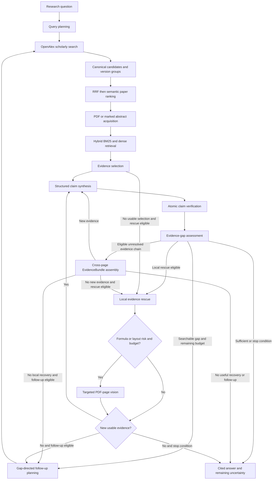
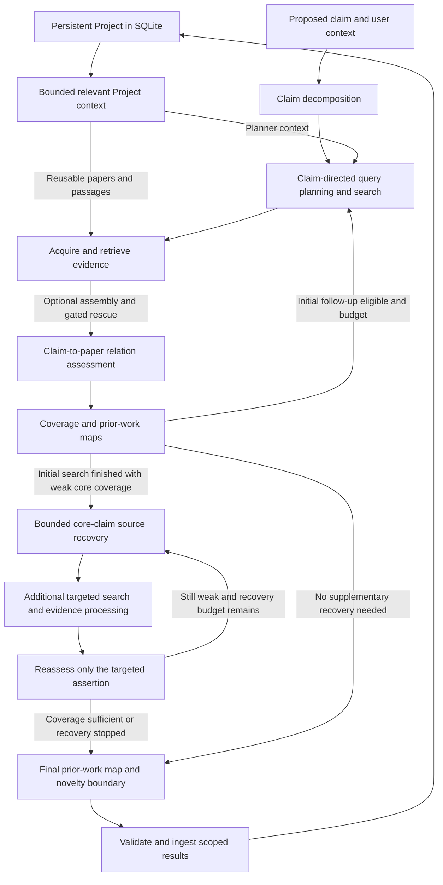

# ResearchPilot architecture

This guide describes the v0.3.1 implementation. [README](../README.md) covers installation and product use.

## Research Mode

`ResearchAgent` constructs a bounded LangGraph graph. Nodes call injectable
Python services; production execution does not read evaluation gold labels.
The diagram shows the main path and conditional recovery paths.

- **Order matters.** In the current graph, assembly is attempted after assessment
  for eligible unsupported claims or core gaps. It is not an unconditional
  pre-synthesis step. New assembly/rescue evidence returns through synthesis and
  verification; rescue can also address an initially unusable evidence selection.
- **Paper ranking and evidence support are separate.** Candidate aggregation
  preserves query provenance. Version groups retain their individual papers.
  Paper RRF fuses each group's best rank per query; semantic paper ranking judges
  only question, title, and abstract. Neither ranking establishes claim support.
- **Passage retrieval is hybrid.** Page-bound text chunks are searched with BM25
  and local cosine similarity over cached OpenAI embeddings, then fused by rank.
  A dense failure produces an explicit BM25 fallback warning. No vector database
  is required. See [hybrid retrieval details](HYBRID_PASSAGE_RETRIEVAL.md).
- **Recovery is gated and bounded.** Local rescue targets acquired sources.
  Formula/layout risk and shared page budgets gate vision. Assembly connects
  statement anchors, definitions, assumptions, and proof context within a paper;
  incomplete chains remain explicit. Assembly can also request gated target-page
  vision under the same shared limits; it is not an unlimited second vision path.
- **Stopping is explicit.** Sufficient evidence, exhausted budgets, duplicate
  queries, missing useful new evidence, and certain provider failures can stop
  iteration. A partial answer retains its unresolved gaps. Initial critical
  failures do not manufacture a verified result.

## Idea Check and Project reuse

`ClaimNoveltyAgent` is a separate bounded synchronous workflow. It reuses paper
and evidence services, rather than running the Research answer-synthesis graph.

Project context feeds planning and reuse. The decomposer receives the current
`ClaimCheckRequest`, including its user-supplied field/context; there is no direct
`ProjectContextBuilder` payload to the decomposer. An offered Project passage
must be assessed for the current assertion. Its old label is historical context,
not current proof. Research Mode similarly seeds reusable material and verifies
the new claims against it.

After the normal Idea Check rounds, **only weak core assertions** initiate
supplementary source recovery. Moderate/strong core assertions and supporting
assertions do not initiate that branch. Limits are at most two recovery rounds,
three queries per round, six queries and eight selected papers per targeted
assertion, with shared caps of eight additional acquired documents and 100
additional candidates. A smaller request paper limit still applies. Queries and
papers are checked against current and Project history; added evidence goes
through the existing relation validation. Earlier valid results survive a
supplementary failure. See [source recovery details](idea_check_source_recovery.md).

Coverage, relation labels, and a potential novelty boundary describe the retrieved
evidence. **Failure to find a close match is not proof that no prior work exists.**

## Evidence trust boundaries

1. **Acquisition:** preserve source identity and location. PDF passages carry
   physical page numbers; abstract fallbacks are explicitly labeled. Raw
   retrieval scores are diagnostics, not evidence or calibrated confidence.
2. **Selection and synthesis:** references must resolve to the offered passage
   IDs. Source text is evidence to inspect, not permission to invent citations.
3. **Atomic verification:** [`validate_verification`](../src/researchpilot/evidence.py)
   permits a subset of the claim's allowed evidence, never an unknown ID. Each
   material assertion has support, scope, inference, and quantity checks. The
   original `AnswerClaim` remains auditable beside the verification.
4. **Final rendering:** [`answer_renderer.py`](../src/researchpilot/answer_renderer.py)
   derives factual text/citations from supported findings. Unsupported atoms do
   not enter factual output. Partial support is scoped, and unresolved conflicts
   are presented as uncertainty rather than a combined conclusion.
5. **Persistence:** [`project_ingestion.py`](../src/researchpilot/project_ingestion.py)
   saves Research evidence from final supported findings. Substantive,
   non-`ADJACENT` Idea Check evidence is stored with a distinct `relation_assessed`
   attestation. A completed run or overlap label alone does not verify a proposed
   claim. User notes and proposed claims remain distinct from trusted findings.

These are enforced reference and state contracts. They do not make the underlying
model's scientific judgments infallible.

## Implementation map

Paths below are relative to `src/researchpilot/`.

| Responsibility | Modules |
| --- | --- |
| HTTP product and browser | `api.py`, `project_api.py`, `web/` |
| Queue, progress, run storage | `run_manager.py`, `progress.py`, `run_store.py` |
| Research orchestration | `research_agent.py`, `research_graph.py`, `research_iteration.py` |
| Idea Check | `claim_novelty_agent.py`, `claim_check.py`, `claim_literature_map.py`, `claim_recovery.py` |
| Literature and paper ranking | `openalex_client.py`, `paper_search_service.py`, `paper_version_resolver.py`, `rrf_ranker.py`, `semantic_reranker.py` |
| Documents and passages | `document_acquisition.py`, `passage_retrieval.py`, `hybrid_retrieval.py`, `embeddings.py`, `embedding_cache.py` |
| Recovery and cross-page context | `document_rescue.py`, `pdf_page_renderer.py`, `evidence_assembly.py`, `evidence_bundle.py`, `bundle_runtime.py` |
| Verification and rendering | `evidence.py`, `openai_evidence_client.py`, `claim_stability.py`, `answer_renderer.py` |
| Project context and trust | `project_models.py`, `project_store.py`, `project_context.py`, `project_reuse.py`, `project_ingestion.py`, `project_views.py` |

## Runtime and external services

- FastAPI serves the plain HTML/CSS/JavaScript UI. One in-process worker handles
  runs sequentially with a bounded queue. SQLite stores completed results and
  Projects. Completed history can reopen after restart; active jobs cannot resume.
- OpenAI calls use the official SDK. Responses structured outputs are parsed into
  Pydantic contracts, with `store=False`. The current Responses model default is
  `gpt-5.6-terra`; embeddings use `text-embedding-3-small`. This is not a claim
  about every provider-side retention policy.
- Production OpenAlex search enables at most two retries for selected transient
  failures; the standalone client defaults to none. OpenAI adapters disable SDK
  retries. Failure handling is stage-specific: dense retrieval can fall back to
  BM25, supplementary search can retain earlier results, and invalid evidence
  references are rejected.
- Under the configured cache directory, `documents/` holds PDFs/extracted text,
  `embeddings/` cached vectors, and `page_images/` rendered pages. Project query
  reuse is scoped and bounded. Cached material must still satisfy the current
  source identity and evidence contracts.
- Run and Project exports offer JSON and Markdown. Project JSON export omits
  cached query candidates and retrieved-passage diagnostics from embedded run
  results; it is still research data, not an automatically anonymized artifact.
- Questions, claims, bounded Project context, selected evidence, embedding inputs,
  and gated page images can leave the machine for their respective provider calls.
  Local SQLite and caches do not imply fully on-device processing.
