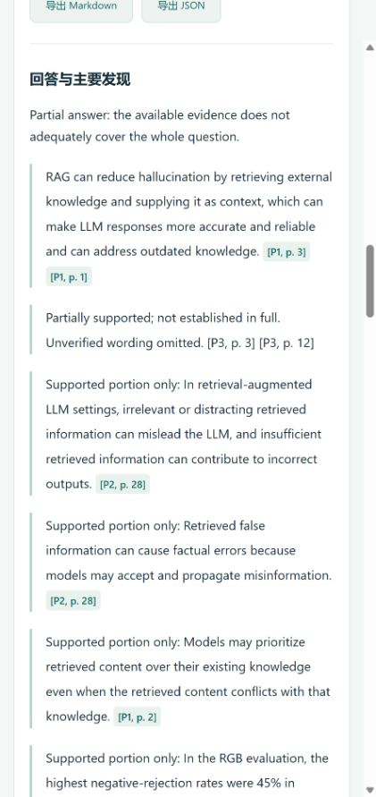
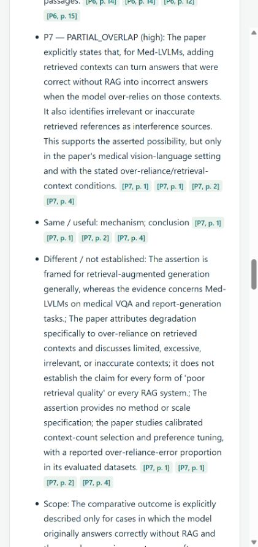

# ResearchPilot case studies

These examples summarize **existing completed runs**, using their saved evidence,
verification records, relation maps, and validation artifacts. They are curated
explanations of observed behavior, not new experiments, an exhaustive literature
review, or a benchmark score for every feature in v0.3.1. No new provider calls
were made to prepare them.

| Case study | Research task | What to look for |
| --- | --- | --- |
| [RAG research](rag-research.md) | General academic research about hallucination and retrieval quality | A useful but explicitly partial answer, page-level support, and unresolved comparisons. |
| [RAG Idea Check](rag-idea-check.md) | Prior-work comparison for a claim about retrieval harming factuality | A medical vision-language result classified as partial overlap, with its domain and comparator preserved. |
| [Matrix completion Idea Check](matrix-completion-idea-check.md) | Technical mathematical prior-work analysis | Separation of sampling assumptions, weight design, spectral quantities, curvature, and recovery guarantees. |

The set covers general research, prior-work analysis, and mathematical reasoning.
All three emphasize what the evidence supports **and what it leaves open**.
Absence of a direct match is never treated as a novelty certificate.

## Reading the evidence

Paper titles and DOI/publisher links identify the sources. Page references are
one-based physical pages of the PDFs acquired in those runs, rather than printed
journal page labels. Public source links replace private application links.
No private database, full run history, downloaded PDF, or manuscript accompanies
these summaries. The records predate this publication snapshot; their historical
outcomes have not been replaced by a new model response.

Historical partial results may have fewer capabilities or different selected
papers than a fresh run of the current implementation. They should not be
combined into a single coverage or performance estimate. Model-based judgments
remain reviewable assessments, not proofs of scientific truth.

## Product screenshots

These are actual narrow-viewport captures of the current UI displaying the two
saved RAG results described above. The isolated local viewer used no provider
keys and started no research jobs. Only the selected completed records were
loaded; private projects and unrelated history were absent. The application UI
currently mixes Chinese controls with English research output.

| Research: explicit partial answer | Idea Check: medical-domain partial overlap |
| --- | --- |
|  |  |

In the Idea Check image, P7 is *RULE: Reliable Multimodal RAG for Factuality in
Medical Vision Language Models*, discussed in the linked case study. Screenshots
are excerpts, not complete reports; the case studies retain the limitations.

[Back to ResearchPilot](../../README.md) · [Current architecture](../architecture.md)
